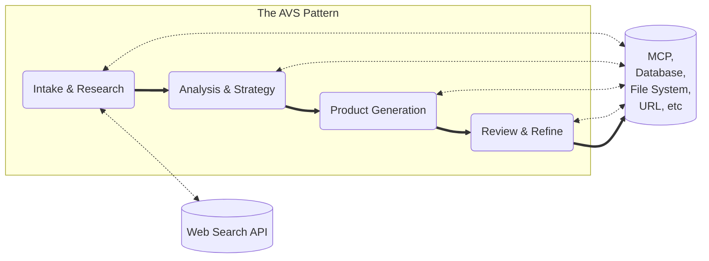
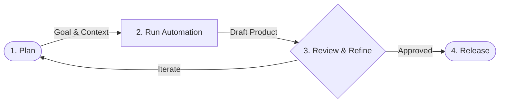

# AVS Value Story

## A Framework for Making AI your personal Force Multiplier.

Developed by **Patrick Heaney**, this framework provides a rigorous methodological shift from "automating work" to **multiplying value** by externalizing tacit knowledge into **Algorithmically Legible Instructions**.

## 🚀 **The Problem: The "Admin Tax" on Leadership**

**For the Technical Program Manager (TPM):**
You were hired to lead strategy, but you spend **15 hours a week** acting as a "human router." You chase status updates, hunt for missing Jira tickets, and manually aggregate data for the Wednesday status meeting.

This is the **"Information Hunt"** [cite: 1.1, 2.1]. It is the administrative tax that prevents you from doing the work you were hired to do.

# 💡 **The Solution: Agentic Value Streams (AVS)**

The AVS Toolkit is your personal force multiplier. It allows you to build **Agentic Value Streams** that automate the collection, synthesis, and dissemination of project context.

Instead of nagging developers for updates, you run a command. The Agent "reads" the repo, checks the backlog, and drafts the status report for you.

**Web Research Integration:** AVS now integrates **Live Web Research** via Gemini 2.5 Flash with Google Search grounding to automate the retrieval of public information and market data.



## Core Definitions

**Value Story**: The atomic unit of agentic work. It is a self-contained module comprising a **Goal** (Outcome), **Instructions** (Algorithm), and **Context-Manifest** (Data) [cite: 2.1.3].

Every Value Story in this repository follows the **Agile v1.2 Standard**, ensuring that every unit of work is aligned with a specific persona and business outcome:

* **As a [Persona]**: Defines the perspective and voice of the agent.

* **I want [Action]**: Defines the specific technical deliverable and success metrics.

* **So that [Value]**: Provides the "Why," allowing the agent to resolve ambiguities through the lens of intended value.

**Algorithmically Legible Instructions**: Precise enough for an AI-Agent to execute with zero "context blindness," yet semantically clear enough for Human-Agents to oversee and audit [cite: 2.2.2].

**Context-Manifest**: A mandatory component that shifts the burden of information retrieval from "runtime execution" to "design-time definition." It supports local files and **Live Web Research** via the `search_query` field [cite: 2.2.3].

## 🧠 The Strategic Shift

Under the **AVS Framework**, the highest-value human contributions complete the shift higher level thinking. Users shift from "doing the work" to strategicly generating and improving the goals, instructions, and context, used by Agentic-AI-Agents to produce the product. This moves the human architect from the role of a "task-manager" to a **"Orchestrator of Agency"** and moves the Agentic AI Agent from a "task-doer" to a **"force multiplier."**

## 🛠️ The Value Story Lifecyle

This diagram illustrates the **Value Story** lifecycle: **Plan** (Human), **Run** (Agent), and **Review** (Human).



## Illustrative Example

Before diving into the technical setup, you can explore a complete Illustrative Example focused on tailoring a resume. This walkthrough demonstrates how a sequence of Value Stories generates a high-fidelity "Strategic Alignment Matrix," mapping a candidate's background to specific job requirements to ensure the agent produces a competitive, fact-based product without context blindness.

## ⚡ Operational Use Cases

> *Note: These scenarios illustrate the architectural vision and workflow of the AVS Framework. The specific Value Stories referenced (`vs-status-report`, `vs-audit-logging`) are conceptual examples of what you can build, rather than pre-installed files in this repository.*

### Scenario A: "The Tuesday Status Report"
*   **The Pain:** Digging through 50 Jira tickets and 3 Slack channels to find out why "Project X" is red.
*   **The AVS Way:** Run `avs run vs-status-report`. The agent checks the repo commits against the Jira board, identifies the discrepancy, and drafts a decision memo for you to review.

### Scenario B: "The Compliance Audit"
*   **The Pain:** Manually verifying if 20 new microservices meet the "Logging Standard."
*   **The AVS Way:** Run `avs run vs-audit-logging`. The agent scans the codebases, flags the 2 violations, and drafts the remediation ticket for the team.

# Getting Started

## 1. Prerequisites

### For Non-Developers

Follow the detailed instructions in the [Guide-Setup-for-Non-Developers](./docs/Guide-Setup-for-Non-Developers.md)
Ensure you have `homebrew` installed on your system:
### For Developers

Verify installation on macOS and Windows (assuming Git Bash or similar shell on Windows)

```bin
if command -v uv &> /dev/null; then
    echo "uv is installed. Version information:"
    uv --version
else
    echo "uv is not installed or not found in the system's PATH."
fi
```

If `uv` is not installed, I included instructions in Phase 5 of the [Setup for Non-Developers](./docs/Guide-Setup-for-Non-Developers.md) guide.

* **Ollama**: Install [Ollama](https://ollama.com) and run `ollama pull llama3`.
* **Gemini API Key**: Required for live web research. Set it in your environment: `export GEMINI_API_KEY="your_key"`.
* **Firecrawl API Key**: Required for web scraping. Set export FIRECRAWL_API_KEY="your_key".

## 2. Installation

Clone the repository and install the toolkit. You have two options:

### Option A: Global System-Wide (Recommended)
This makes the `avs` command available in any folder on your computer.
```bash
git clone https://github.com/AVS-Orchestration/avs-toolkit.git
cd avs-toolkit
uv tool install .
```

### Option B: Local Developer Mode
Use this if you plan on modifying the toolkit's source code.
```bash
git clone https://github.com/AVS-Orchestration/avs-toolkit.git
cd avs-toolkit
uv sync
```
*Note: In local mode, you must prefix commands with `uv run avs`.*

## 3. Setting up Your Private Workspace

The AVS Toolkit is the *engine*, but you need a *factory* to do your work. We call this the **AVS Private Workspace**. This is a folder on your local machine (e.g., in OneDrive/Dropbox) where your sensitive data and custom Value Stories live.

**The Golden Rule:** Never modify the Toolkit or Standard Library directly. Always work within your Private Workspace.

### Workspace Structure
```text
my-avs-workspace/                      <-- Your Private Root
├── .env                               <-- Your API Keys (Secrets)
├── avs-toolkit/                       <-- Cloned Toolkit (The Engine)
├── avs-standard-library/              <-- Cloned Library (The Blueprints)
│
└── my-active-project/                 <-- YOUR WORK HAPPENS HERE
    ├── inputs/                        <-- Your Resumes, Data, Transcripts
    ├── outputs/                       <-- The Agent's Results
    └── private-stories/               <-- Custom Value Stories you build
```

*To create this structure, see the [Non-Developer Setup Guide](docs/Guide-Setup-for-Non-Developers.md).*

## 4. Your First Governance Pass

Validate the provided template to ensure your environment is configured correctly:

```bin
uv run avs validate templates/vs-000-template.md
```

## 🛠 The Toolkit CLI

The `avs` toolkit provides a suite of commands to move from architectural intent to execution.

> **Note:** All command examples below assume you are running them from your workspace root directory (e.g., `my-avs-workspace/`).

### `validate`

`uv run avs validate `

Checks a Value Story against the "Building Code" (Pydantic models). It ensures your goal is properly framed and your instructions meet the minimum precision requirements.

```bin
uv run avs validate avs-standard-library/templates/vs-000-template.md
```

### `assemble`

`uv run avs assemble `

The "Information Hunt" automation. It reads your `context_manifest`, **performs live web research via Gemini 1.5 Flash** (if `search_query` is present), and packages everything into a **Briefcase** (`*-assembled.yaml`) stamped with a unique `assembled_at` timestamp.

```bin
uv run avs assemble avs-standard-library/templates/vs-000-template.md
```

### `run`

`uv run avs run `

Executes the Value Story. If the file has not been assembled yet, `run` will automatically perform the assembly step before dispatching the payload to your local LLM (defaulting to Ollama/Llama3).

```bin
uv run avs run avs-standard-library/templates/vs-000-template.md --local
```

🧠 **Advanced**: See [Model Orchestration Guide](docs/GUIDE_MODEL_ORCHESTRATION.md) for using specialized models like Gemma or Mistral.

## 📂 Architecture: Value Story vs. Briefcase

The AVS Toolkit manages the lifecycle of a Value Story through three distinct file types visible in the repository:

1. **The Value Story (`VS-XXX.md`)**: The human-editable source of truth. It contains the Goal, Instructions, and pointers to context. This is what you commit to Git.
2. **The Assembled VS (`VS-XXX-assembled.yaml`)**: An execution-ready snapshot. Created by `avs assemble`, it contains the logic plus the **full injected text** of all context assets.
3. **The Output Product (`VS-XXX_output.md`)**: The final deliverable generated by the Agent. This is saved to the `output_path` defined in your Blueprint (e.g., `outputs/` or `illustrative-example/`).

> **Tip:** We recommend adding `*-assembled.yaml` to your `.gitignore` to prevent repository bloat and accidental exposure of sensitive context data.

## 🏗 Repository Structure

* `src/avs_toolkit/`: The core orchestration engine.
  * `models.py`: Pydantic data schemas for Value Stories.
  * `parser.py`: Hybrid YAML/Markdown logic engine.
  * `runner.py`: Local execution logic for Ollama/Llama3.
  * `main.py`: CLI command definitions.
* `illustrative-example/`: A complete Resume Tailoring stream.

* `VS-000-template.md`: Master markdown template for new Value Stories.
* `Visual-Studio-Code-Setup-Guide.md`: Dev environment optimization.
* `docs/`: A library of implementation guides including [Gemini Search Setup](./docs/GUIDE_GEMINI_SEARCH_SETUP.md).
* `ARCHITECTURE.md` & `SOURCES.md`: Framework documentation.

## 🏅 About the Author

Patrick Heaney brings over 20 years of experience in high-stakes program management and the intelligence community [cite: user_context].

Recipient of two "US Army Top 10 Inventions" awards for systems that drastically reduced friction and saved lives in combat environments [cite: user_context].

Architect of the AVS Framework, designed to solve the structural "context gap" in modern enterprise AI [cite: 1.1, 6.2].

## 📄 License & Attribution

This work is licensed under the Creative Commons Attribution-ShareAlike 4.0 International (CC BY-SA 4.0).

### How to Cite

If you utilize this framework, templates, or logic in a professional, academic, or commercial context, please provide attribution as follows:

Heaney, P. (2025). AVS Value Story: A Framework for Autonomous Orchestration. GitHub: PatrickHeaney/avs-value-story.
