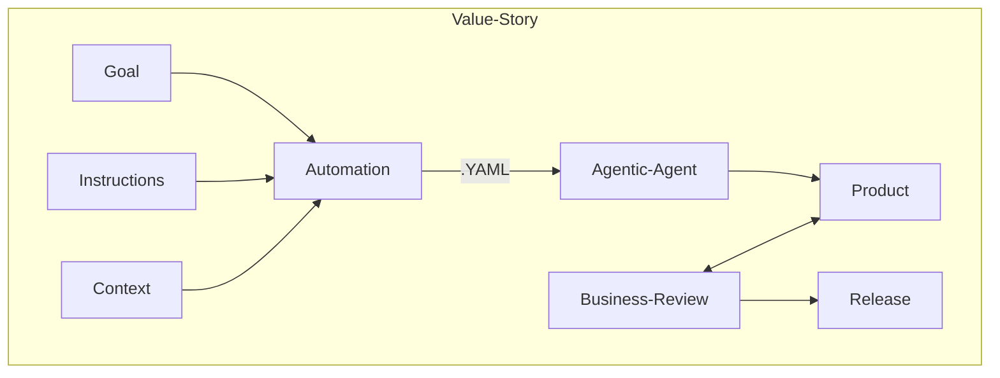
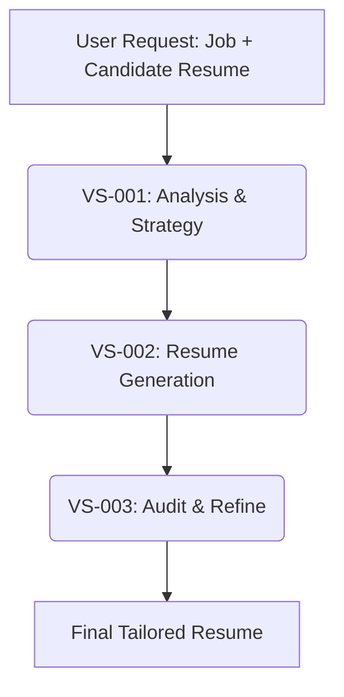

# AVS Value Story

## A Framework for Multiplying Human Value in the Era of Autonomous Orchestration.

Developed by Patrick Heaney, this framework provides a rigorous methodological shift from "automating work" to multiplying value by externalizing tacit knowledge into Algorithmically Legible Instructions.

🚀 **The Problem: The Information Hunt**

The current crisis in knowledge work is characterized by the "5–15 hour information hunt"—time lost every week by workers simply trying to gather the context needed to do their actual jobs [cite: 1.1, 2.1]. This "context blindness" is the primary reason AI deployments fail, lead to hallucinations, or require excessive human oversight [cite: 2.4, 6.2].

💡 **The Solution: Agentic Value Streams (AVS)**

The Agentic Value Stream (AVS) tracks the flow of agency and decision-making rather than just static data [cite: 1.1]. It organizes the capabilities of Large Language Models (LLMs) into a linear, cumulative sequence of value creation centered around the Value Story [cite: 1.1].

### Core Definitions

**Value Story**: The atomic unit of agentic work. It is a self-contained module comprising a Goal (Outcome), Instructions (Algorithm), and Context (Data) [cite: 2.1.3].

**Algorithmically Legible Instructions**: Precise enough for an AI-Agent to execute with zero "context blindness," yet semantically clear enough for Human-Agents to oversee and audit [cite: 2.2.2].

**Context**: A mandatory component that shifts the burden of information retrieval from "runtime execution" to "design-time definition," effectively eliminating the "Information Hunt" [cite: 2.2.3].

## 🛠️ Framework Architecture

### The Strategic Shift

Under the AVS Framework, the highest-value human contributions shift from "doing the work" to generating and improving the goals, instructions, and context used by Agentic-AI-Agents to produce the product.

## 🏅 About the Author

Patrick Heaney brings over 20 years of experience in high-stakes program management and the intelligence community [cite: user_context].

Recipient of two "US Army Top 10 Inventions" awards for systems that drastically reduced friction and saved lives in combat environments [cite: user_context].

Architect of the AVS Framework, designed to solve the structural "context gap" in modern enterprise AI [cite: 1.1, 6.2].

## 📄 License & Attribution

This work is licensed under the Creative Commons Attribution-ShareAlike 4.0 International (CC BY-SA 4.0).

### How to Cite

If you utilize this framework, templates, or logic in a professional, academic, or commercial context, please provide attribution as follows:

Heaney, P. (2025). AVS Value Story: A Framework for Autonomous Orchestration. GitHub: PatrickHeaney/avs-value-story.

## 🤝 Getting Started

Explore the Templates: Check the /templates folder for YAML schemas for creating your first Value Story.

Integrate with MCP: This repository includes implementation guides for the Model Context Protocol (MCP) to provide mandatory context to your agents [cite: 7.1].

Contribute: Fork this repo to share your own "Algorithmically Legible" instructions for common industry value streams.

## ✨ Illustrative Example: Tailored Resume Generation

To demonstrate the power of Agentic Value Streams, consider the task of generating a tailored resume for a specific job application. This complex task can be broken down into a sequence of interconnected Value Stories:

### 1. VS-001: Analysis & Strategy

**Goal:** Understand the job description and the candidate's existing resume to identify key skills, experiences, and keywords for optimal matching.
**Instructions:**
*   Parse job description to extract required skills, keywords, and responsibilities.
*   Parse candidate's raw resume to identify relevant experience, education, and achievements.
*   Perform a gap analysis between job requirements and candidate profile.
*   Develop a strategic plan for resume tailoring, including prioritization of content and keyword integration.
**Context:** Job description (URL or text), Candidate's raw resume (PDF or text).

### 2. VS-002: Resume Generation

**Goal:** Produce a draft resume tailored to the specific job application, following the strategic plan.
**Instructions:**
*   Select and prioritize relevant sections and bullet points from the candidate's raw resume based on the strategic plan.
*   Rewrite/rephrase existing bullet points to incorporate job-specific keywords and align with the job description's language.
*   Ensure resume adheres to best practices for formatting and readability.
**Context:** Output from VS-001 (strategic plan), Candidate's raw resume, Resume formatting guidelines.

### 3. VS-003: Audit & Refine

**Goal:** Evaluate the tailored resume against the job description for alignment, completeness, and effectiveness, then refine as needed.
**Instructions:**
*   Compare tailored resume against job description for keyword density and thematic alignment.
*   Check for clarity, conciseness, and absence of generic language.
*   Identify any remaining gaps or areas for improvement.
*   Suggest specific revisions to optimize the resume further.
**Context:** Tailored resume (draft), Original job description, Best practices for resume optimization.

### Value Stream Flow

The sequence of these Value Stories forms a clear, auditable Agentic Value Stream:

### The Automation Step: Assembling the AI Prompt

In the AVS framework, "Automation" isn't the AI thinking; it is the **assembly line** that builds the perfect prompt.

To multiply human value, we don't just "ask the AI." We systematically assemble the prompt by combining:
1.  **The Goal:** The specific outcome defined by the human architect.
2.  **The Instructions:** The "Algorithmically Legible" logic for *how* to do the work.
3.  **The Context:** The specific data (e.g., `job-description.md` and `raw-resume.md`) needed to prevent hallucination.

This process generates a single, auditable package (the Value Story YAML) that serves as the **Context-Rich, Algorithmically Legible Prompt** for the Agent.

*👉 Check the `/illustrative-example` folder to see the input files and the resulting assembled YAML.*
