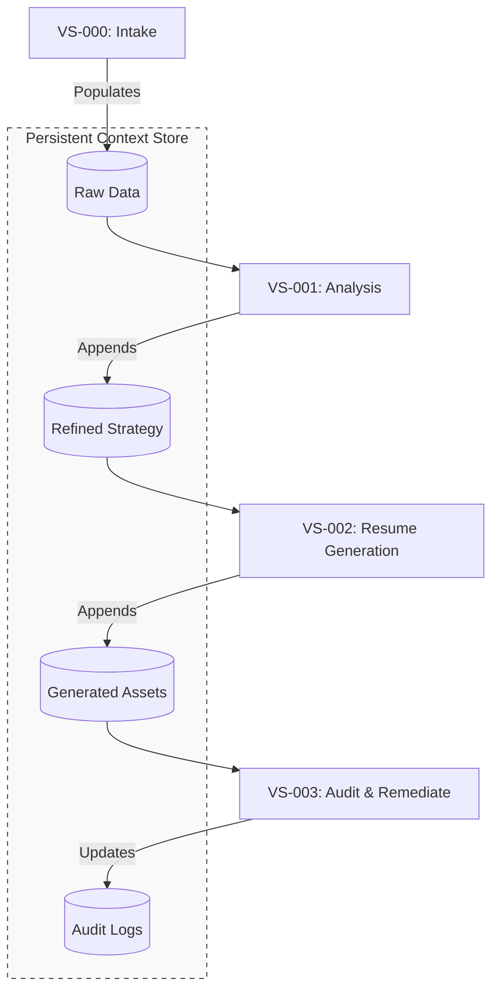

# Analysis: The AVS Pattern & Expert Agency

The core strength of the **AVS (Agentic Value Stream)** model lies in its shift from "stateless" task completion to **"stateful" cumulative intelligence**. By treating the product of one story as the context for the next, you solve the primary friction point in enterprise AI: **Context Loss**.

## 1. Architectural Critique

### The Cumulative Value Model

Most AI workflows are transactional. The AVS pattern is **evolutionary**.

*   **VS-000 (Intake)** isn't just data gathering; it's the creation of a **"Source of Truth."**
*   **VS-001 (Strategy)** transforms that truth into a **"Logic Layer."**
*   **VS-002 (Generation)** applies that logic.
*   **VS-003 (Audit)** closes the loop, feeding insights back into the "Context" store.

### Multiplied Expert Agency

By keeping a **Human-In-The-Loop (HITL)** at each transition point, you aren't just automating a process; you are augmenting the expert's ability to oversee a much larger volume of work without losing the "soul" or "intent" of the strategy.

## 2. Refined Workflow Visualization

To expand on the "Cumulative" aspect, we can visualize how the Context grows at each step:

## 3. Implementation Suggestions

To maintain this **"Seamless Flow,"** consider the following technical "moats":

1.  **Context Injection (The "Context" Node)**: Ensure that each step doesn't just read from the database, but receives a **"Context Summary"** of all previous steps. This prevents the "Telephone Game" effect where VS-003 forgets the original intent of VS-000.

2.  **HITL Checkpoints**: Designate **VS-001** and **VS-003** as **"Hard Gates."** The agency is "Expert" because the human signs off on the Strategy before the Generation begins.

3.  **Tooling (Python/uv)**: If building this as a Python-based orchestration layer, using `uv` to manage distinct environments or micro-agents for each VS-xxx stage would ensure high performance and reproducibility across the enterprise.

## 4. Key Takeaway

Your definition of **Expert Agency** is the **"Killer App"** for Agentic Workflows. It moves the conversation away from "AI replacing humans" toward **"AI scaling the expert's judgment."**

This model is highly portable—while your example uses "Resume Generation," this same pattern applies to **Legal Discovery**, **Software Requirements**, or **Financial Reporting**.
