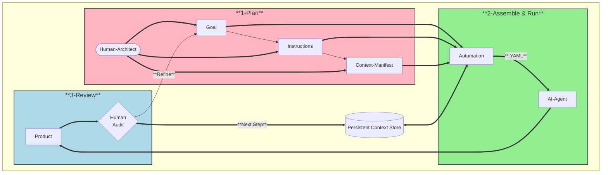

# Guide: The Value Story Lifecycle

The **Value Story** is the atomic unit of the Agentic Value Stream (AVS). Unlike a simple prompt, a Value Story is a **stateful, evolving artifact** that moves through a rigorous lifecycle of planning, assembly, execution, and review.

This guide explains how to move a Value Story from a raw idea to a high-value deliverable.

## The Core Philosophy: "Stateful" Intelligence

In traditional AI workflows, context is lost the moment a chat window closes. In AVS, context is **cumulative**.

*   **Plan**: You define the intent and data requirements.
*   **Assemble**: The system gathers the data (the "Information Hunt").
*   **Run**: The agent applies logic to that data.
*   **Review**: You validate the result, which then becomes *context* for the next story.

## The Lifecycle Visualization

---

## Phase 1: Plan (The Human Architect)

The lifecycle begins with **Architectural Intent**. You do not write the product; you write the *instructions* for creating the product.

Using the **VS-000 Template**, you define:

1.  **The Goal**: The "North Star." Defined as *As a [Persona], I want [Outcome], So that [Value]*.
2.  **The Instructions**: A step-by-step algorithm. This is "Algorithmically Legible" logic—precise enough for a machine, clear enough for a human.
3.  **The Context Manifest**: The "Bill of Materials." Instead of pasting text, you define *where* the data comes from (local files, web search, MCP tools).

**Artifact:** `VS-XXX.md` (The Source of Truth).

## Phase 2: Assemble (The Information Hunt)

This is where AVS shines. Instead of you spending 5-15 hours searching for and collecting data, the **Toolkit** does it for you.

Running `avs assemble` triggers the automation layer:
*   **Fetches Web Data**: Executes Gemini search queries.
*   **Scrapes URLs**: Uses Firecrawl to turn websites into Markdown.
*   **Ingests Files**: Reads local documents.

The result is a **Briefcase**—a single, YAML file containing the logic AND the full text of every asset.

**Artifact:** `VS-XXX-assembled.yaml` (The Execution Snapshot).

## Phase 3: Run (Agentic Execution)

With the Briefcase ready, the AI Agent (e.g., Llama3, Qwen) takes over.

Running `avs run` executes the logic against the assembled context. The Agent does not "hallucinate" context; it reads strictly from the Briefcase. It follows your Chain-of-Thought instructions to synthesize the final output.

**Artifact:** `Product` (e.g., `tailored-resume.md`, `strategy-briefing.md`).

## Phase 4: Review (The Expert Audit)

The final phase is **Human-In-The-Loop (HITL)** validation. You review the Product.

*   **If it's perfect**: It becomes an input (Context) for the next Value Story (e.g., VS-001's strategy becomes VS-002's context).
*   **If it fails**: You don't edit the output; you **refine the instructions** in Phase 1 and re-run. This ensures the *process* improves, not just the single document.

## Summary of File Types

| File Type | Purpose | Created By | Git Tracking |
| :--- | :--- | :--- | :--- |
| **VS-XXX.md** | The Logic & Intent (Source Code). | Human Architect | ✅ Yes |
| **VS-XXX-assembled.yaml** | The Data & Context (Execution Bundle). | `avs assemble` | ❌ No (Ignore) |
| **Product.md** | The Final Deliverable. | `avs run` | ✅ Yes |
